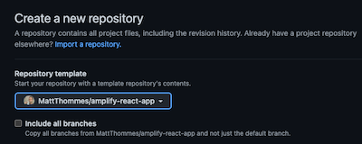
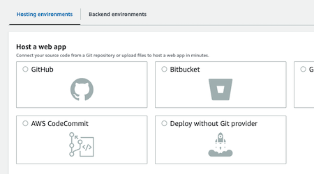
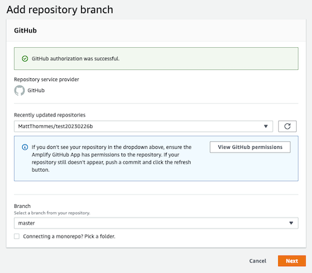
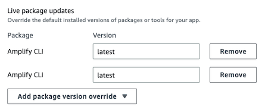
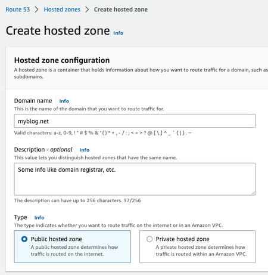

# ⛅️ ⚛︎ Amplify React App: 🛠️ Developer Guide

## Overview

Amplify React App is generated from [Create React App](https://create-react-app.dev/). Once created, the app is updated via the `react-scripts` development dependency (see [Updating to New Releases](https://create-react-app.dev/docs/updating-to-new-releases) and [changelog](https://github.com/facebook/create-react-app/blob/main/CHANGELOG.md)).

## Local project setup

### Create from template

1. Create a new Github repo for your new project from the amplify-react-app template:
    *  
2. Clone your new repo locally, example:
    * `git clone git@github.com:[GITHUB_USERNAME]/amplify-react-app-test1.git`
3. Create a new project in your IDE. Proceed to below steps from within your project README.dev.md.

### Project specific setup

1. Update the git remotes for your new project to include a remote named `upstream` for the base repo ([amplify-react-app](https://github.com/MattThommes/amplify-react-app)) so future changes can be pulled in:
    * `git remote add upstream git@github.com:MattThommes/amplify-react-app.git`
2. Sync your new repo to merge all unrelated history from the upstream/template repo. Whenever you need to update your repo with changes from the upstream repo, repeat these steps:
    1. `git fetch upstream`
    2. `git merge upstream/master --allow-unrelated-histories`
    3. Fix conflicts (if any; the further your app has diverged, the more there will be). Don’t fix package-lock.json conflicts - just do `git add package-lock.json` and it will get regenerted.
    4. Run `nvm use` then `npm update`.
        1. If nvm is not found, run `source ~/.nvm/nvm.sh`.
    5. Run `git add package-lock.json`.
    6. Commit changes: `git commit -m "Updated to latest amplify-react-app"`
    7. `git push origin master` (assuming `master` branch)
3. Update these files to include your specific project related information:
    1. README.md (keep README.dev.md for following along or future debugging)
    2. package.json (name and description)
    3. public/index.html (`<title>` and `<meta name="description"`)
    4. public/manifest.json (`short_name` and `name`)
    5. src/App.js (`const SiteName`)
4. Check Amplify version to verify it is installed globally:
    * `amplify --version`
5. Run `npm install`. Add and commit package-lock.json again: `git commit -m "Dependency updates"`
6. Run `npm start` and confirm build works and default React site appears at http://localhost:3000
7. Proceed to Amplify CLI setup steps, then come back here.
8. If you haven’t already, commit and push any changes. Initial changes should look similar to:
    * `modified:   .gitignore`
    * `modified:   README.md`
    * `modified:   package-lock.json`
    * `modified:   package.json`
    * `modified:   public/index.html`
    * `modified:   public/manifest.json`
    * Don’t forget newly generated files:
        1. `git add amplify` (not fully sure if this is needed since it can be auto-generated again when pulling an app down, but better safe than sorry)
    * Using `git add *` is faster.
    * `git commit -m "After running amplify init"`
9. To aid Amplify with creating a staging environment, create a `staging` branch (from `master` branch) locally then push:
    1. `git checkout -b staging`
    2. `git push origin staging`

## Amplify CLI setup

1. Run `amplify init` to setup a new Amplify project. If you are pulling down an existing Amplify project, the command will be something like this: `amplify pull --appId 12345`.
    1. Enter a name for the project (or hit Enter to use the default): alpha only and <= 20 characters.
    2. Enter `n` (No) for `Initialize the project with the above configuration?`
    3. Enter `dev` for name of the environment (or hit Enter to use the default).
    4. Choose `Visual Studio Code` or `None` for your default editor.
    5. Choose `javascript` for the type of app that you’re building.
    6. Choose `react` for javascript framework.
    7. Source Directory Path: `src`
    8. Distribution Directory Path: `build`
    9. Build Command: `npm run build`
    10. Start Command: `npm start`
    11. If you ran `amplify init` for a fresh Amplify app, continue to the next step. If you ran `amplify pull --appId ...` to pull down an existing Amplify app, continue to step 16.
    12. Select the profile you want to use.
        * If you don’t see the correct profile, edit ~/.aws/config and ~/.aws/credentials to ensure it is present in both files.
    13. Decide for yourself for this question:
        * `✔ Help improve Amplify CLI by sharing non sensitive configurations on failures (y/N)`
    14. Once it finishes setting up your local and cloud environment, you should see a message similar to:
        * `Deployment state saved successfully.`
        * `✔ Initialized provider successfully.`
        * `✅ Initialized your environment successfully.`
        * `Your project has been successfully initialized and connected to the cloud!`
        * `Some next steps:`
    15. You should see a new amplify directory appear in your project files.
    16. Visit the [AWS Amplify console](https://us-east-1.console.aws.amazon.com/amplify/home?region=us-east-1#/) to verify the app was created:
        * 

## Amplify console setup

1. In the AWS console, under “Hosting environments,” connect your new app to Github for both `master` and `staging` branches.
    1. Choose your Git repository:
        * 
    2. Choose repository and `master` branch:
        * 
    3. Check “Enable full-stack continuous deployments (CI/CD).”
        * 
    4. For “Select an existing service role or create a new one,” use your best judgement - there are no hard requirements here yet.
        * 
    5. Under Advanced settings > “Live package updates,” Amplify CLI should be set to “latest.”
        * 
    6. Click Next then “Save and deploy.”
    7. Repeat the same steps for the staging branch.
2. Under the “Rewrites and redirects” section, add a new item with source address `</^((?!\.(css|gif|ico|jpg|js|png|txt|svg|woff|ttf)$).)*$/>` and target address `/index.html`. Choose “200 (Rewrite)” for the Type.
3. Under “Hosting environments” confirm the build and deploy fully worked for staging and master branches.
4. Click the amplifyapp URL’s for each environment and verify the default React app is showing.

### Adding a custom domain

1. Go to Route 53 > Hosted zones > Create hosted zone.
    * 
2. Under Amplify Domain management, click Add domain. You should see the Route 53 domain you just added appear in the dropdown/selector.
3. I personally don’t care for the www redirect, so I uncheck “Setup redirect from https:// to https://www”
4. Update nameservers at the domain registrar (Ie. Name.com) to point to AWS - you should see the nameservers in Route 53 when editing the new domain.

## Adding cloud resources

### API

Your frontend may eventually need to call a backend for accessing cloud resources. Here is how to create an initial generic endpoint to get started:

1. `amplify add api`
2. Provide friendly name, example `amplifyreactappapi1`
3. Provide a path: `/backend`
    * _This is usually a more specific resource name but for example sake it is generic here. You can still add custom request endpoints using only one Lambda. Example: /backend/posts or /backend/books/whatever_
4. Provide an AWS Lambda function name. Example: `amplifyreactappaug20lambda`
5. Choose the runtime that you want to use.
    * _I normally go with NodeJS but completely up to your skillset and level of comfort._
6. Choose the function template that you want to use.
    * _Starting with “Hello World” is usually simplest._
7. Do you want to configure advanced settings?
    * _It is wise to review these settings even if you don’t change anything yet._
8. Do you want to edit the local lambda function now? The location for our example is [here](amplify/backend/function/amplifyreactappaug20lambda/src/index.js).
9. After creating the function locally you should see these next steps output (these are good to keep in mind as a reference):
    * Check out sample function code generated in `<project-dir>/amplify/backend/function/amplifyreactappaug20lambda/src`.
    * `amplify function build` builds all of your functions currently in the project.
    * `amplify mock function <functionName>` runs your function locally.
    * To access AWS resources outside of this Amplify app, edit the `/Users/[USERNAME]/Documents/dev/amplify-react-app/amplify/backend/function/amplifyreactappaug20lambda/custom-policies.json`.
    * `amplify push` builds all of your local backend resources and provisions them in the cloud.
    * `amplify publish` builds all of your local backend and front-end resources (if you added hosting category) and provisions them in the cloud.
10. Restrict API access?
    * _Choose no for now._

#### Run your function locally

Example of how to test your function locally:

1. `amplify mock function amplifyreactappaug20lambda`
    * Example output:
        ```
        ✔ Provide the path to the event JSON object relative to /Users/[USERNAME]/Documents/dev/amplify-react-app/amplify/backend/function/amplifyreactappaug20lambda
        ```
        * _Using_ `src/event.json` _is fine._
    * In the function folder locally you should see an event.json file appear with a test event object:
        ```
        {
            "key1": "value1",
            "key2": "value2",
            "key3": "value3"
        }
        ```
        * Let’s change this to a more realistic event from an API request (an About page):
            ```
            {
                "resource": "/about",
                "path": "/about",
                "httpMethod": "GET"
            }
            ```
    * You can also edit the actual Lambda code ([our example Lambda file here](amplify/backend/function/amplifyreactappaug20lambda/src/index.js)) and save that, which will then be pushed up to the AWS Lambda.
        * Go ahead and edit the Lambda code and add in custom output that changes based on the path used in the request ([full example here](readme_examples/lambda_intro_index.js)):
            ```
            // exports.handler = async (event) => { ...

            bodyOutput = JSON.stringify('Hello from Lambda!');

            if (event.path.match(/^\/about\/?/)) {
                bodyOutput = JSON.stringify('Hello from Lambda! This is the about page.');
            }

            return {
                statusCode: 200,
                body: JSON.stringify(bodyOutput),
            };
            ```
            * Re-run the `amplify mock` test and you should see the custom output for the About page request:
                ```
                Starting execution...
                EVENT: {"resource":"/about","path":"/about","httpMethod":"GET"}
                ✅ Result:
                {
                "statusCode": 200,
                "body": "\"\\\"Hello from Lambda! This is the about page.\\\"\""
                }
                Finished execution.
                ```

### Images

When adding image storage for the first time:

1. `amplify add storage`
2. Choose `Content (Images, audio, video, etc.)`
3. Enter `y` when asked to add auth (Amazon Cognito)
4. Choose `Default configuration`
5. Choose `Email` when asked `How do you want users to be able to sign in?`
6. Enter a short custom identifier string for `Provide a friendly name for your resource`
7. You can leave the default bucket name as it is already unique - just hit Enter.
8. For `Who should have access` choose `Auth users only`
9. For `What kind of access do you want for Authenticated users?` select all options using the spacebar.
10. Enter `n` for `Do you want to add a Lambda Trigger for your S3 Bucket?`
11. Log into the AWS console and go to the S3 section.
12. Verify the number of buckets you have - once you push the changes you should see a new bucket created.
13. Run `amplify push` to push the local storage changes to the cloud.
14. Verify in AWS console you see the new bucket created, something like `thommesfamvacationsaf92c0e5c7194a05804f41a082b0110057-dev`
    1. You can also run `aws s3 ls` locally to see your buckets.

Syncing local images to S3:

```
$ aws s3 sync ~/Documents/dev/[PROJECT]/images/ s3://[BUCKET_NAME] --acl public-read
```

The `images` folder is just a placeholder for syncing purposes. It is not meant to hold every single image. Once an image is synced to the cloud you can delete the file locally. `.gitignore` already has a rule to ignore the root level `/images/` directory.

Example image usage in code:

```

```
