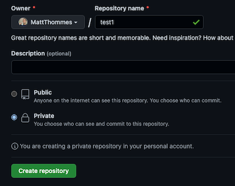

# Development Instructions

_Updated February 26, 2023_

## Background

Amplify React App is generated from [Create React App](https://create-react-app.dev/). Once created, the app is updated via the `react-scripts` development dependency (see [Updating to New Releases](https://create-react-app.dev/docs/updating-to-new-releases) and [changelog](https://github.com/facebook/create-react-app/blob/main/CHANGELOG.md)).

## Local project setup

### Automated steps (BETA)

1. cd into project directory
2. Set permissions for script (if needed): `/bin/chmod 700 setup.sh`
3. Run script (from project directory root): `./setup.sh`

### Manual steps (PREFERRED)

1. Create Github repo for new project from the amplify-react-app template:
    * 
    *  
2. Clone new repo into project directory locally:
    * `git clone git@github.com:MattThommes/test1.git`
3. Create new project in your IDE for the new directory. Proceed to below steps from within your new project README.dev.md.
4. Update the remotes for the new project to include `upstream` to the base repo (amplify-react-app) so future changes can be pulled in:
    * `git remote add upstream git@github.com:MattThommes/amplify-react-app.git`
5. Sync your new repo to merge all unrelated history from the upstream/template repo:
    1. `git fetch upstream`
    2. `git merge upstream/master --allow-unrelated-histories`
    3. `git push origin master` (assuming `master` branch)
    4. Whenever you need to update your repo with changes from the upstream repo, repeat the above steps.
6. Update these files to include your specific project name and description:
    1. README.md (keep the `README.dev.md` for following along or future debugging)
    2. package.json
    3. public/index.html
    4. public/manifest.json
    5. src/App.js (`const SiteName`)
7. Get `nvm` available in your current CLI session: `source ~/.nvm/nvm.sh`. You may need to install it if you haven’t used it before.
8. Run `nvm use` to use the correct Node version associated with the project. You should see output similar to:
    * `Found '/Users/mattthommes/Documents/dev/test1/.nvmrc' with version <v16.13.0>`
    * `Now using node v16.13.0 (npm v9.5.1)`
9. Check Amplify version to verify it is installed globally:
    * `amplify --version`
    * Assuming it is installed globally (check package.json for `aws-amplify`). If it is not installed yet, try running:
        * `npm install -g @aws-amplify/cli`
        * [More information](https://docs.amplify.aws/cli/start/install/)
10. Run `npm install`
    1. You may receive some warnings about GraphQL which can be ignored (this needs to be cleaned up but has not caused any issues yet):
        ```
        npm WARN ERESOLVE overriding peer dependency
        npm WARN While resolving: relay-compiler@12.0.0
        npm WARN Found: graphql@14.7.0
        npm WARN node_modules/graphql
        npm WARN   peer graphql@"^0.13.0 || ^14.0.0" from @ardatan/graphql-tools@4.1.0
        ...
        ```
11. Run `npm start` and confirm build works and default React site appears at http://localhost:3000
12. Run `amplify init` to setup a new Amplify project:
    1. Enter a name for the project (or hit Enter to use the default): all lower case without dashes, underscores, or spaces.
    2. Enter `n` (No) for `Initialize the project with the above configuration?`
    3. Enter `dev` for name of the environment (or hit Enter to use the default).
    4. Choose `Visual Studio Code` or `None` for your default editor.
    5. Choose `javascript` the type of app that you're building.
    6. Choose `react` javascript framework.
    7. Source Directory Path: `src`
    8. Distribution Directory Path: `build`
    9. Build Command: `npm run build`
    10. Start Command: `npm start`
    11. For `Using default provider  awscloudformation ? Select the authentication method you want to use:`, choose `AWS profile`.
    12. Select the profile you want to use.
        * If you don’t see the correct profile, edit ~/.aws/config and ~/.aws/credentials to ensure it is present in both files.
    13. Once it finishes setting up your local and cloud environment, you should see a message similar to:
        * `Deployment state saved successfully.`
        * `✔ Initialized provider successfully.`
        * `✅ Initialized your environment successfully.`
        * `Your project has been successfully initialized and connected to the cloud!`
    14. Visit the [AWS Amplify console](https://us-east-1.console.aws.amazon.com/amplify/home?region=us-east-1#/) to verify the app was created:
        * 
13. Commit changes then push. Initial changes should look similar to:
    * `modified:   .gitignore`
    * `modified:   README.md`
    * `modified:   package-lock.json`
    * `modified:   package.json`
    * `modified:   public/index.html`
    * `modified:   public/manifest.json`
    * Don’t forget newly generated files:
        1. `git add amplify` (not sure if this is needed since it can be auto-generated again)
    * Using `git add *` is faster.
    * `git commit -m "After running amplify init"`
    * Then push: `git push origin master`
14. Prepare `staging` branch (from `master` branch) locally then push:
    1. `git checkout -b staging`
    2. `git push origin staging`

## Amplify console setup

1. In the AWS console, under “Hosting environments,” connect your new app to Github for both `master` and `staging` branches.
    1. Click Next after the first screen:
        * 
    2. Under “Select a backend environment to use with this branch,” choose “dev” environment.
    3. Check “Enable full-stack continuous deployments (CI/CD).”
    4. For “Select an existing service role or create a new one,” use your best judgement - there are no hard requirements here yet.
    5. Under “Live package updates,” Amplify CLI should be set to “latest.”
    6. Click Next then “Save and deploy.”
2. Under Build settings, verify the contents of [amplify.yml](amplify.yml) match what is in the repo file.
3. Under the “Rewrites and redirects” section, add a new item with source address `</^((?!\.(css|gif|ico|jpg|js|png|txt|svg|woff|ttf)$).)*$/>` and target address `/index.html` (don’t include the backticks for either). Choose “200 (Rewrite)” for the Type.
4. Confirm the build and deploy fully works in AWS along with the default URL showing the React app.

### Adding a custom domain

1. Go to Route 53 > Hosted zones > Create hosted zone. Mirror how another domain already setup looks.
2. Under Amplify Domain management, click Add domain. You should see the Route 53 domain you just added appear in the dropdown/selector.
3. I personally don’t care for the www redirect, so I uncheck “Setup redirect from https:// to https://www”
4. Update nameservers at the domain registrar (Ie. Name.com) to point to AWS - you should see the nameservers in Route 53 when editing the new domain.

## Adding resources

### Images

When adding image storage for the first time:

1. `amplify add storage`
2. Choose `Content (Images, audio, video, etc.)`
3. Enter `y` when asked to add auth (Amazon Cognito)
4. Choose `Default configuration`
5. Choose `Email` when asked `How do you want users to be able to sign in?`
6. Enter a short custom identifier string for `Provide a friendly name for your resource`
7. You can leave the default bucket name as it is already unique - just hit Enter.
8. For `Who should have access` choose `Auth users only`
9. For `What kind of access do you want for Authenticated users?` select all options using the spacebar.
10. Enter `n` for `Do you want to add a Lambda Trigger for your S3 Bucket?`
11. Log into the AWS console and go to the S3 section.
12. Verify the number of buckets you have - once you push the changes you should see a new bucket created.
13. Run `amplify push` to push the local storage changes to the cloud.
14. Verify in AWS console you see the new bucket created, something like `thommesfamvacationsaf92c0e5c7194a05804f41a082b0110057-dev`
    1. You can also run `aws s3 ls` locally to see your buckets.

Syncing local images to S3:

```
$ aws s3 sync ~/Documents/dev/[PROJECT]/images/ s3://[BUCKET_NAME] --acl public-read
```

The `images` folder is just a placeholder for syncing purposes. It is not meant to hold every single image. Once an image is synced to the cloud you can delete the file locally. `.gitignore` already has a rule to ignore the root level `/images/` directory.

Example image usage in code:

```

```
