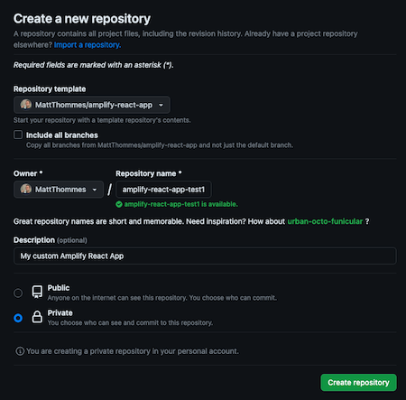

# ⛅️ ⚛︎ Amplify React App: 🛠️ Developer Guide

## Overview

Amplify React App is built using Vite and React. It serves as a modern, fast template for building single-page applications (SPA’s) on AWS Amplify.

## Local project setup

### Create from template

1.  Create a new Github repo for your new project from the amplify-react-app template:
    *   
2.  Clone your new repo locally, example:
    *   `git clone git@github.com:[GITHUB_USERNAME]/amplify-react-app-test1.git`
3.  Open the cloned project in your IDE and follow the setup steps below.

### Project specific setup

After cloning the project, you can run the included setup script to automate most of the initial configuration. This script will install NVM (if not present), set up the correct Node.js version, install dependencies, and configure Git remotes.

`./setup.sh`

Any project created from the amplify-react-app template should follow these steps:

1.  Update the git remotes for your new project to include a remote named `upstream` for the base repo (amplify-react-app) so future changes can be pulled in (run `git remote -v` to view existing remotes):
    *   `git remote add upstream git@github.com:MattThommes/amplify-react-app.git`
2.  To sync with updates from the template repo, run the following commands:
    1.  `git fetch upstream`
    2.  `git merge upstream/master --allow-unrelated-histories`
    3.  Resolve any merge conflicts.
    4.  `git push origin master`
3.  Update these files to include your specific project related information:
    1.  README.md (keep README.dev.md for following along or future debugging)
    2.  package.json (name and description)
    3.  public/index.html (`<title>` and `<meta name="description"`)
    4.  public/manifest.json (`short_name` and `name`)
4.  Load the correct Node.js version and install dependencies:
    *   `source ~/.nvm/nvm.sh && nvm use`
    *   `npm install`
5.  Commit your project-specific updates:
    *   `git add .`
    *   `git commit -m "Project specific updates"`
6.  To aid Amplify with creating a staging environment, create a `staging` branch (from `master` branch) locally then push:
    1.  `git checkout -b staging`
    2.  `git push origin staging`

## Amplify Gen 1 Backend Setup
### Initializing Amplify
1.  **Install the Amplify CLI:** If you don't have it, install it globally:
    *   `npm install -g @aws-amplify/cli`
2.  **Configure Amplify:** Configure the CLI with your AWS credentials.
    *   `amplify configure`
3.  **Initialize Amplify in the project:**
    *   `amplify init`
    *   Follow the prompts to set up your project. This will create a new `amplify` directory with your backend definition.
4.  **Start the frontend:** In a separate terminal, start the Vite development server:
    *   `npm run dev`
5.  Your React app will be running at `http://localhost:5173` (or another port if 5173 is busy).

### Deploying Backend Changes
When you add or update backend resources (e.g., `amplify add auth`), you deploy them using the Amplify CLI.
*   `amplify push`
This command will provision the resources in your AWS account for the current environment.

## Amplify console setup

1.  In the AWS Amplify Console, create a new app and connect your GitHub repository.
    *   !Amplify connect repo
2.  Connect your `master` and `staging` branches.
    *   Amplify will create backend environments for each branch (e.g., `staging`, `prod`).
    *   !Amplify connect branch
3.  During the build settings configuration, Amplify will detect the `amplify.yml` file in your repository. Confirm the settings. Check the box to "Allow AWS Amplify to automatically deploy all files hosted with Amplify".
4.  Create or select a Service Role that gives Amplify permission to deploy resources on your behalf.
    *   !Amplify service role
5.  Review your settings and click "Save and deploy".
6.  Amplify will start the first deployment for the branch. You can monitor the progress in the console.
7.  **Rewrites and Redirects**: For single-page apps (SPAs), you need a rewrite rule to serve `index.html` for all routes that are not files. Add the following rule in the "Rewrites and redirects" section:
    *   **Source address:** `</^((?!\.(css|gif|ico|jpg|js|png|txt|svg|woff|ttf|webmanifest)$).)*$/>`
    *   **Target address:** `/index.html`
    *   **Type:** `200 (Rewrite)`
    *   !Amplify rewrite
8.  Once deployment is complete, click the app URL to verify that your application is live.

## Adding a custom domain

1.  Go to Route 53 > Hosted zones > Create hosted zone for your domain.
    *   !Route 53 Create hosted zone
2.  In the Amplify Console, go to "Domain management" and click "Add domain".
3.  Select your domain from the dropdown and click "Configure domain".
4.  You can configure subdomains and redirects. I personally uncheck the www redirect.
5.  Amplify will provide instructions for creating the necessary CNAME records in Route 53 to verify domain ownership and route traffic. Follow the steps to complete the setup.

## Adding cloud resources

To add or update backend resources like APIs, authentication, and databases, you use the Amplify CLI.

*   `amplify add api`
*   `amplify add auth`
*   `amplify add storage`
