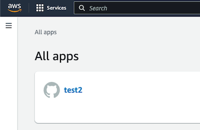
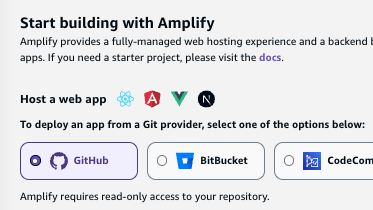
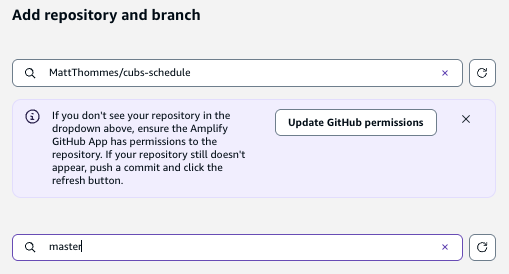
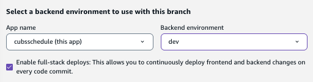
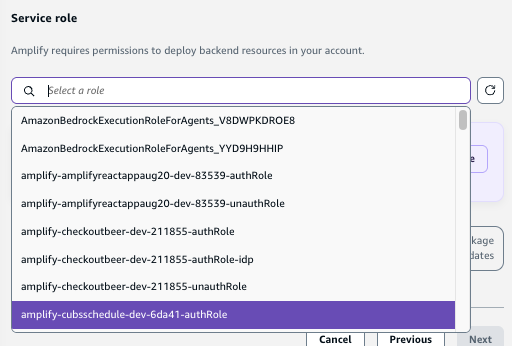
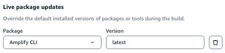
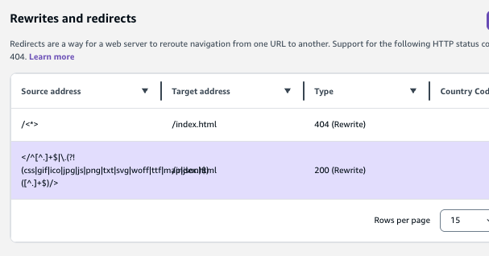
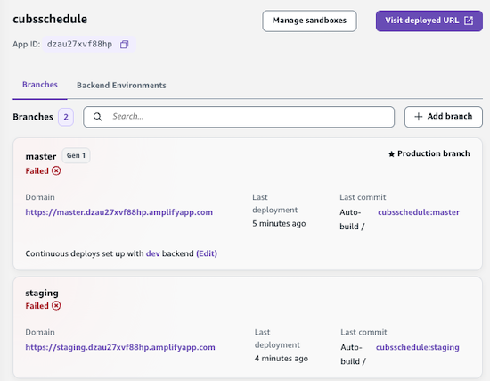
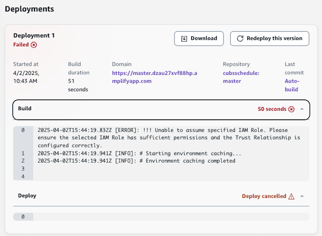

# ⛅️ ⚛︎ Amplify React App: 🛠️ Developer Guide

## Overview

Amplify React App is built using Vite and React. It serves as a modern, fast template for building single-page applications (SPAs) on AWS Amplify.

## Local project setup

### Make quick updates to website content

If you just need to make a quick update to the website content, you can follow
these steps:

1. Load the right Node version: `source ~/.nvm/nvm.sh && nvm use`
2. Run `npm run dev` to start the local development server.
3. Make your changes to the website content.
4. For new images, run `npm run image-sync` (see [Images](images/README.md)).
5. Commit your changes and push to Github which should trigger a new build and deploy.

### Create from template

1. Create a new Github repo for your new project from the amplify-react-app template:
    * 
2. Clone your new repo locally, example:
    * `git clone git@github.com:[GITHUB_USERNAME]/amplify-react-app-test1.git`
3. Create a new project in your IDE. Proceed to below steps from within your project README.dev.md.

### Child project specific setup

Any project created from the amplify-react-app template should follow these steps:

1. Update the git remotes for your new project to include a remote named `upstream` for the base repo ([amplify-react-app](https://github.com/MattThommes/amplify-react-app)) so future changes can be pulled in (run `git remote -v` to view existing remotes):
    * `git remote add upstream git@github.com:MattThommes/amplify-react-app.git`
2. Sync your new repo to merge all unrelated history from the upstream/template repo. Whenever you need to update your repo with changes from the upstream repo, repeat these steps:
    1. `git fetch upstream`
    2. `git merge upstream/master --allow-unrelated-histories`
    3. Fix conflicts (if any; the further your app has diverged, the more there will be). Don’t fix package-lock.json conflicts - just do `git add package-lock.json` and it will get regenerted.
    4. Run `nvm use` then `npm update` (note this is nPm)
        1. If nvm is not found, run `source ~/.nvm/nvm.sh`
    5. Run `git add package-lock.json`.
    6. Commit changes: `git commit -m "Updated to latest amplify-react-app"`
    7. `git push origin master` (assuming `master` branch)
3. Update these files to include your specific project related information:
    1. README.md (keep README.dev.md for following along or future debugging)
    2. package.json (name and description)
    3. public/index.html (`<title>` and `<meta name="description"`)
    4. public/manifest.json (`short_name` and `name`)
    5. src/App.js (`const SiteName`)
4. `git commit -m "Project specific updates"`
5. Check Amplify version to verify it is installed globally:
    * `amplify --version`
6. Run `npm install`. Add and commit package-lock.json again: `git commit -m "Dependency updates"`
7. Run `npm run dev` and confirm build works and default React site appears at http://localhost:3000
8. Proceed to Amplify CLI setup steps, then come back here.
9. If you haven’t already, commit and push any changes. Initial changes should look similar to:
    * `modified:   .gitignore`
    * `modified:   README.md`
    * `modified:   package-lock.json`
    * `modified:   package.json`
    * `modified:   public/index.html`
    * `modified:   public/manifest.json`
    * Don’t forget newly generated files:
        1. `git add amplify` (OPTIONAL)
            * If you commit the amplify directory it will use this at deployment time to generate the cloud resources. I’ve noticed the builds take a bit longer when this is included. You can also opt to not include it and let Amplify generate the cloud resources solely from the CLI.
    * Using `git add *` is faster.
    * `git commit -m "After running amplify init"`
10. To aid Amplify with creating a staging environment, create a `staging` branch (from `master` branch) locally then push:
    1. `git checkout -b staging`
    2. `git push origin staging`

## Amplify app setup

1. Run `amplify init` to setup a new Amplify project. If you are pulling down an existing Amplify project, the command will be something like this: `amplify pull --appId 12345`.
    * As of April 2025, I had better luck creating the app in Amplify console first, then pull it down locally.
2. Enter a name for the project (or hit Enter to use the default): alpha only and <= 20 characters.
3. Enter `n` (No) for `Initialize the project with the above configuration?`
4. Enter `dev` for name of the environment (or hit Enter to use the default).
5. Choose `Visual Studio Code` or `None` for your default editor.
6. Choose `javascript` for the type of app that you’re building.
7. Choose `react` for javascript framework.
8. Source Directory Path: `src`
9. Distribution Directory Path: `dist`
10. Build Command: `npm run build`
11. Start Command: `npm run dev`
12. If you ran `amplify init` for a fresh Amplify app, continue to the next step. If you ran `amplify pull --appId ...` to pull down an existing Amplify app, continue to step 16.
13. Select the profile you want to use (typically it is `amplify-feb2021-b`).
    * If you don’t see the correct profile, edit ~/.aws/config and ~/.aws/credentials to ensure it is present in both files.
14. Decide for yourself for this question:
    * `✔ Help improve Amplify CLI by sharing non sensitive configurations on failures (y/N)`
15. Once it finishes setting up your local and cloud environment, you should see a message similar to:
    * `Deployment state saved successfully.`
    * `✔ Initialized provider successfully.`
    * `✅ Initialized your environment successfully.`
    * `Your project has been successfully initialized and connected to the cloud!`
    * `Some next steps:`
16. You should see a new amplify directory appear in your project files.
    * Commit these files since they are configuration.
    * Remember you are probably on staging branch locally.
17. Visit the [AWS Amplify console](https://us-east-1.console.aws.amazon.com/amplify/home?region=us-east-1#/) to verify the app was created:
    * 

## Amplify console setup

1. In the AWS console, under “Branches,” connect your new app to Github for both `master` and `staging` branches.
    1. Choose your Git repository:
        * 
    2. Choose repository and `master` branch:
        * 
    3. Check “Enable full-stack deploys”
        * 
    4. For “Service role,” try to find out that was just created for your new app.
        * 
    5. Under Advanced settings > “Live package updates,” Amplify CLI should be set to “latest.”
        * 
    6. Click Next then “Save and deploy.”
    7. Repeat the same steps for the staging branch (you should only have to connect the staging branch and not configure anything else).
2. Under the “Rewrites and redirects” section, add a new item with source address `</^((?!\.(css|gif|ico|jpg|js|png|txt|svg|woff|ttf)$).)*$/>` and target address `/index.html`. Choose “200 (Rewrite)” for the Type.
    * As of April 2, 2025, this is already there by default.
    * 
3. Under “Overview,” confirm the build and deploy fully worked for staging and master branches.
    * 
4. If you see deployment failures, try to find why:
    * 
5. Click the amplifyapp URL’s for each environment and verify the default React app is showing.

### Adding a custom domain

1. Go to Route 53 > Hosted zones > Create hosted zone.
    * 
2. Under Amplify Domain management, click Add domain. You should see the Route 53 domain you just added appear in the dropdown/selector.
3. I personally don’t care for the www redirect, so I uncheck “Setup redirect from https:// to https://www”
4. Update nameservers at the domain registrar (Ie. Name.com) to point to AWS - you should see the nameservers in Route 53 when editing the new domain.

## Adding cloud resources

* [API’s](api/README.md)
* [Images](images/README.md)
* [Databases](databases/README.md)
