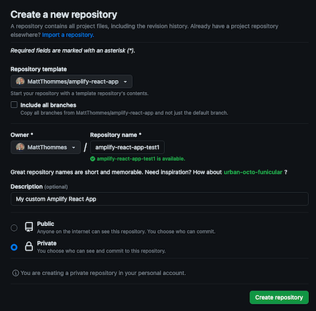
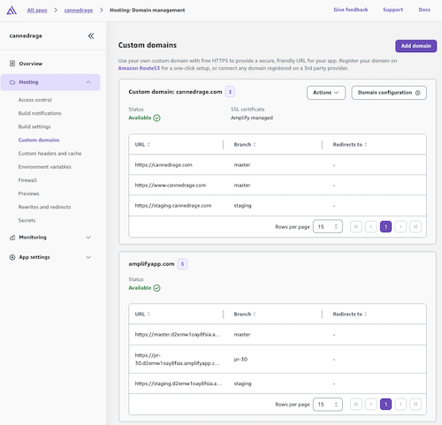

# ⛅️ ⚛︎ 🚀 Amplify React App: 🛠️ Developer Guide

## Overview

Amplify React App is built using Vite and React. It serves as a modern, fast template for building single-page applications (SPA’s) on AWS Amplify.

## Prerequisites

Before you begin, ensure you have the following tools installed on your local machine:

*   **Node.js and npm**: (e.g., v20 or later). You can download them from [nodejs.org](https://nodejs.org/).
    *   **Verify installation**: `node -v` and `npm -v`
*   **Git**: For version control. You can download it from [git-scm.com](https://git-scm.com/).
    *   **Verify installation**: `git --version`
*   **AWS CLI**: For configuring your AWS credentials. Follow the [official installation guide](https://docs.aws.amazon.com/cli/latest/userguide/cli-chap-install.html).
    *   **Verify installation**: `aws --version`
*   **AWS Amplify Gen 2 CLI**: The command-line tool for managing your Amplify backend.
    ```sh
    npm install -g @aws-amplify/backend-cli
    ```
    *   **Verify installation**: `amplify version`
    
    > **Note**: This template is built for Amplify **Gen 2**. If you have an older version of the CLI (`@aws-amplify/cli`), please upgrade to the Gen 2 CLI.

## New project setup

### Create / sync from template

1.  Create a new Github repo for your new project from the amplify-react-app template:
    *   
2.  Clone your new repo locally, example:
    *   `git clone git@github.com:[GITHUB_USERNAME]/amplify-react-app-test1.git`
3.  Open the cloned project in your IDE and follow the setup steps below.

### Project specific setup

Open [Makefile](../Makefile).

After cloning the project, you can run the included setup script to automate most of the initial configuration. This is safe to run repeatedly.

`make setup`

⚠️ Stop other local apps running on port 3000/3001 so there is no conflict.

Start the app locally to see it in the browser:

`make run-dev`

You will notice API calls will fail. We will setup the API shortly.

* http://localhost:3001/
* `(failed)net::ERR_CONNECTION_REFUSED`

Does not need to be done right now, but anytime **after running setup**, you can pull down the latest changes from the upstream repo by running this script:

`make sync-upstream`

Cleanup as a good practice for npm taking up a lot of disk space:

`make cleanup`

Optional but good to do early for new projects: update these files to include your specific project related information:

1.  [README.md](../README.md)
    1. The setup script will adjust the header automatically.
    2. Keep this file though: [README.dev.md](README.dev.md) – for general app updates and instructions synced in via upstream.
2.  [package.json](../package.json) (name and description)
3.  [public/index.html](../index.html) (`<title>` and `<meta name="description"`)
4.  [public/manifest.json](../public/manifest.json) (`short_name` and `name`)

Commit your project-specific updates:

*   `git add .`
*   `git commit -m "Project specific updates"`

Stop any other apps running locally on ports 3000 or 3001, otherwise the next commands will conflict.

## Amplify setup

### AWS CLI access

Before initializing Amplify, ensure your AWS credentials are set up on your local machine. The Amplify CLI uses the same credential provider chain as the AWS CLI and other SDK’s, looking for credentials in environment variables or your AWS credentials file (commonly `~/.aws/credentials`).

If you haven’t configured credentials, you can run `aws configure` to create a profile.

### Initialize new Amplify app

Gen 2 introduces a new code-first approach to building your backend. You define your backend resources (like authentication, database, storage) using TypeScript inside the `amplify/` directory.

To initialize your backend sandbox environment for local development, run:

```sh
npx ampx sandbox
```

This command will deploy your backend to a personal cloud sandbox environment. Keep this process running in a terminal tab while you develop. It automatically syncs local changes in your `amplify/` directory to your cloud sandbox.

### Amplify environment and branch setup

With Gen 2, Amplify Hosting handles environments and deployments based on your git branches.

1. Commit your changes and push to your git repository.
2. Go to the [AWS Amplify console](https://us-east-1.console.aws.amazon.com/amplify/apps).
3. Connect your repository and select your main branch.
4. Amplify will automatically detect this as a Gen 2 project by looking for the `amplify/` folder and `amplify.yml`.
5. It will run a fullstack deployment, provisioning your production backend and deploying your frontend.

To set up a staging environment, simply create a new branch (e.g., `staging`), push it, and connect it in the Amplify Console. Amplify will create a separate isolated backend for that branch.

### Configuring the API

In Gen 2, APIs are defined in TypeScript. See the `amplify/backend.ts` file and other related files in the `amplify/` directory to configure your API and connected Lambda functions or DynamoDB tables.

Once defined, your frontend code can access the API using the Gen 2 syntax:

```javascript
import { get } from 'aws-amplify/api';

const restOperation = get({
  apiName: 'yourApiName',
  path: '/your/path'
});
const response = await restOperation.response;
```

### Rewrite rule

For single-page apps (SPA’s), you need a rewrite rule to serve `/index.html` for all client-side routes. This also helps avoid a trailing slash at the end of the path in the URL and API requests, example: https://master.d1j6aypbzelxhd.amplifyapp.com/about/

In the “Rewrites and redirects” section, Amplify often creates a default rule for you. If not, or if you need to edit it, click “Edit” to open the JSON editor and ensure it contains the following rule:

```json
[
  {
    "source": "/<*>",
    "status": "404-200",
    "target": "/index.html"
  }
]
```

This one is not there by default, and is good to add to avoid the trailing slash issue:

```
{
    "source": "</^((?!\\.(css|gif|ico|jpg|js|png|txt|svg|woff|ttf)$).)*$/>",
    "status": "200",
    "target": "/index.html"
}
```

## Adding a custom domain

To connect a custom domain to your Amplify application, you'll first need to have a registered domain. If you don't have one, you can register one through Amazon Route 53 or any other domain registrar.

### 1. Ensure a Hosted Zone in Route 53

For Amplify to automatically configure your DNS records, your domain must be managed in an Amazon Route 53 public hosted zone.

*   If your domain is registered with Route 53, a hosted zone is typically created for you automatically.
*   If your domain is with another registrar, you'll need to create a hosted zone in Route 53 for your domain. Then, update the name server (NS) records at your registrar to point to the name servers assigned by Route 53.

### 2. Add the domain in AWS Amplify

1.  In the AWS Amplify console for your app, navigate to **Hosting > Custom domains** (or **Domain management** in the older UI) and click **Add domain**.
2.  Select your domain from the dropdown list (Amplify will detect domains in your Route 53 account) and click **Configure domain**.

Example: 

### 3. Configure subdomains and redirects

1.  On the configuration screen, you can set up subdomains. A common practice is to use the root domain (e.g., `example.com`) for one branch (like `main`/`prod`) and a subdomain (e.g., `staging.example.com`) for another branch (like `staging`).
2.  You can also configure a redirect from `www` to the root domain (or vice-versa). You can choose to disable this if it doesn't fit your needs.
3.  Click **Save**.

### 4. Wait for SSL/TLS and DNS propagation

Amplify will now provision an SSL/TLS certificate for your domain and create the necessary DNS records (A, AAAA, CNAME) in your Route 53 hosted zone. This process can take anywhere from a few minutes to a couple of hours. You can monitor the status in the Amplify console. Once complete, your application will be available at your custom domain.

## Adding cloud resources

To add or update backend resources like APIs, authentication, and databases, you define them using TypeScript in the `amplify/` directory. The Amplify Gen 2 documentation provides extensive examples for each service.

## Deleting your Amplify app and cleaning up resources

If you need to delete your app, you can do so from the AWS Amplify Console.

1. Open the AWS Amplify console.
2. In the list of applications, choose the name of the app you want to delete.
3. On the app's page, find the Actions dropdown menu and select Delete app.
4. You will be prompted to confirm the deletion. This will delete both the frontend hosting environment and the associated backend resources.
