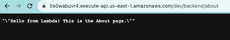

# ⛅️ ⚛︎ Amplify React App: 🛠️ Developer Guide

[Developer Guide home](../README.dev.md)

## Cloud Resources: API’s

Your frontend may eventually need to call a backend for accessing cloud resources. Here is how to create an initial generic endpoint to get started:

1. `amplify add api`
2. Select from one of the below mentioned services: `REST`
3. Provide friendly name, example: `amplifyreactappapi1`
4. Provide a path: `/backend`
    * _This is usually a more specific resource name but for example sake it is generic here. You can still add custom request endpoints using only one Lambda. Example: /backend/posts or /backend/books/whatever_
5. Provide an AWS Lambda function name. Example: `amplifyreactapplambda1`
6. Choose the runtime that you want to use.
    * _I normally go with NodeJS but completely up to your skillset and level of comfort. The rest of these instructions assume you are using NodeJS._
7. Choose the function template that you want to use.
    * _Starting with “Hello World” is usually simplest._
8. Do you want to configure advanced settings?
    * _It is wise to review these settings even if you don’t change anything yet._
9. Choose the package manager that you want to use to manage dependencies: `NPM`
10. Do you want to edit the local lambda function now? You can choose `No` and then look for the file here (so you get familiar with where it lives): `/amplify/backend/function/amplifyreactapplambda1/src/index.js`.
11. After creating the function locally you should see these next steps output (these are good to keep in mind as a reference):
    * Check out sample function code generated in `<project-dir>/amplify/backend/function/amplifyreactapplambda1/src`.
    * `amplify function build` builds all of your functions currently in the project.
    * `amplify mock function <functionName>` runs your function locally.
    * To access AWS resources outside of this Amplify app, edit the `/[...]/amplify-react-app/amplify/backend/function/amplifyreactapplambda1/custom-policies.json`.
    * `amplify push` builds all of your local backend resources and provisions them in the cloud.
    * `amplify publish` builds all of your local backend and front-end resources (if you added hosting category) and provisions them in the cloud.
12. Restrict API access?
    * _Choose no for now._

### Run your API function locally

Your API will automatically hit the Lambda function you created. Locally you will want to test hitting the Lambda function as you build it out.

Example of how to test your function locally:

1. `amplify mock function amplifyreactapplambda1`
    * Example output:
        ```
        ✔ Provide the path to the event JSON object relative to /[...]/amplify-react-app/amplify/backend/function/amplifyreactapplambda1
        ```
        * _Using the default_ `src/event.json` _is fine._
    * In the function folder locally you should see an event.json file appear with a test event object:
        ```
        {
            "key1": "value1",
            "key2": "value2",
            "key3": "value3"
        }
        ```
        * Let’s change this to a more realistic event from an API request (an About page request):
            ```
            {
                "resource": "/backend/{proxy+}",
                "path": "/backend/about",
                "httpMethod": "GET",
                "queryStringParameters": null,
                "multiValueQueryStringParameters": null,
                "pathParameters": {
                    "proxy": "about"
                },
                "body": null,
                "isBase64Encoded": false
            }
            ```
    * You can also edit the actual Lambda code: `../../amplify/backend/function/amplifyreactapplambda1/src/index.js` and save that, which will then be pushed up to the cloud AWS Lambda.
        * Go ahead and edit the Lambda function file and paste in the [full example here](lambda_intro_index_1.js).
        * Re-run the `amplify mock` command from above and you should see the custom output for the About page request:
            ```
            Starting execution...
            EVENT: {"resource":"/about","path":"/about","httpMethod":"GET"}
            ✅ Result:
            {
            "statusCode": 200,
            "body": "\"\\\"Hello from Lambda! This is the About page.\\\"\""
            }
            Finished execution.
            ```

### Deploying your function

Running the `amplify status` command should show you that the function is not deployed yet. The operation column should say `Create` for the function and the API:

```
┌──────────┬────────────────────────────┬───────────┬───────────────────┐
│ Category │ Resource name              │ Operation │ Provider plugin   │
├──────────┼────────────────────────────┼───────────┼───────────────────┤
│ Function │ amplifyreactapplambda1     │ Create    │ awscloudformation │
├──────────┼────────────────────────────┼───────────┼───────────────────┤
│ Api      │ amplifyreactappapi1        │ Create    │ awscloudformation │
└──────────┴────────────────────────────┴───────────┴───────────────────┘
```

Update your `.env` file with your API resource name listed above:

```
REACT_APP_ENV_API_NAME=amplifyreactappapi1
```

To deploy these resources to the cloud run `amplify push` and then `amplify status` again to see the updated status:

```
┌──────────┬────────────────────────────┬───────────┬───────────────────┐
│ Category │ Resource name              │ Operation │ Provider plugin   │
├──────────┼────────────────────────────┼───────────┼───────────────────┤
│ Function │ amplifyreactapplambda1     │ No Change │ awscloudformation │
├──────────┼────────────────────────────┼───────────┼───────────────────┤
│ Api      │ amplifyreactappapi1        │ No Change │ awscloudformation │
└──────────┴────────────────────────────┴───────────┴───────────────────┘
```

You should also see a new unique REST endpoint is provided to you. Example:

```
REST API endpoint: https://0s0wabuvr4.execute-api.us-east-1.amazonaws.com/dev
```

You can now use your unique endpoint to make requests to your Lambda function. Example browser request output:



When you make changes to the [the actual Lambda code](../../amplify/backend/function/amplifyreactappaug20lambda/src/index.js) and save them, running `amplify status` will show that the function has changed and needs to be deployed again by running `amplify push`:

```
┌──────────┬────────────────────────────┬───────────┬───────────────────┐
│ Category │ Resource name              │ Operation │ Provider plugin   │
├──────────┼────────────────────────────┼───────────┼───────────────────┤
│ Function │ amplifyreactapplambda1     │ Update    │ awscloudformation │
├──────────┼────────────────────────────┼───────────┼───────────────────┤
│ Api      │ amplifyreactappapi1        │ No Change │ awscloudformation │
└──────────┴────────────────────────────┴───────────┴───────────────────┘
```

Lastly, update your environment variables in AWS Amplify console with the same API name as above.

### Accessing your API from your frontend code

You can now access your API from your frontend code. There is already code in App.js to make requests once the environment variable `REACT_APP_ENV_API_NAME` is provided a value.

By default on page load an API request will run for whatever the URL path is.

```
setBackendPath(location.pathname.replace(/^\/+/, ''));
```

You can also trigger a backend request for any path by simply updating the state value:

```
setBackendPath('blog-posts');
```

### Securing your API endpoint

Initially your API endpoint can be requested without authorization which is fine for simple backend requests from your website. If you need a more standalone API, you might want to restrict access to only authenticated users. To do this you can run `amplify update api` and follow the prompts:

1. Select the API you want to update: `amplifyreactappaug20api1`
2. Select the path: `/backend`
3. Select the Lambda source: `amplifyreactappaug20lambda`
4. Set Restrict API access: `yes`
5. Who should have access? `Authenticated users only`
6. What kind of access do you want for Authenticated users? `create, read, update, delete`
